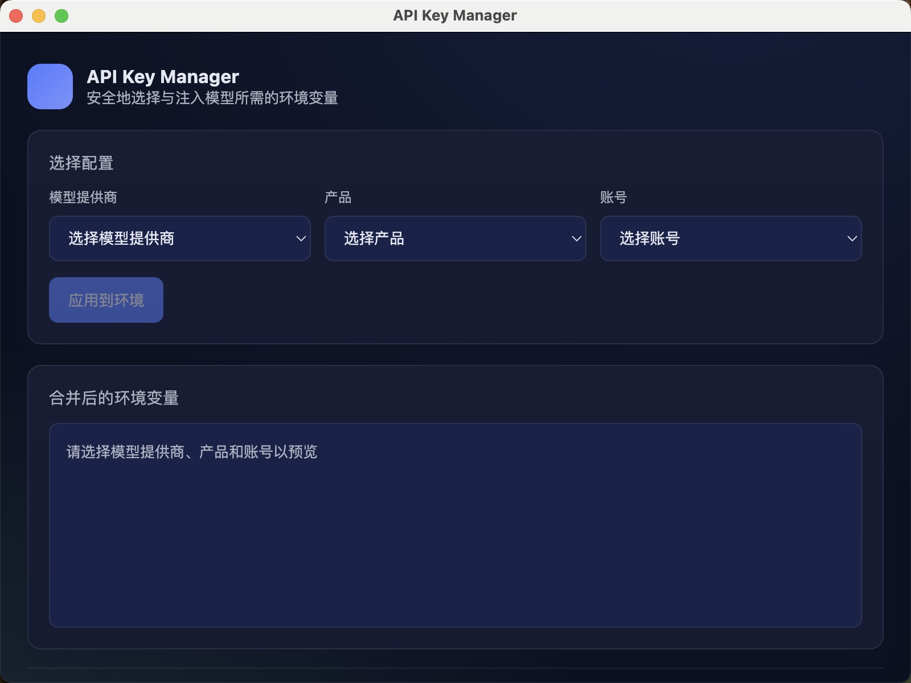
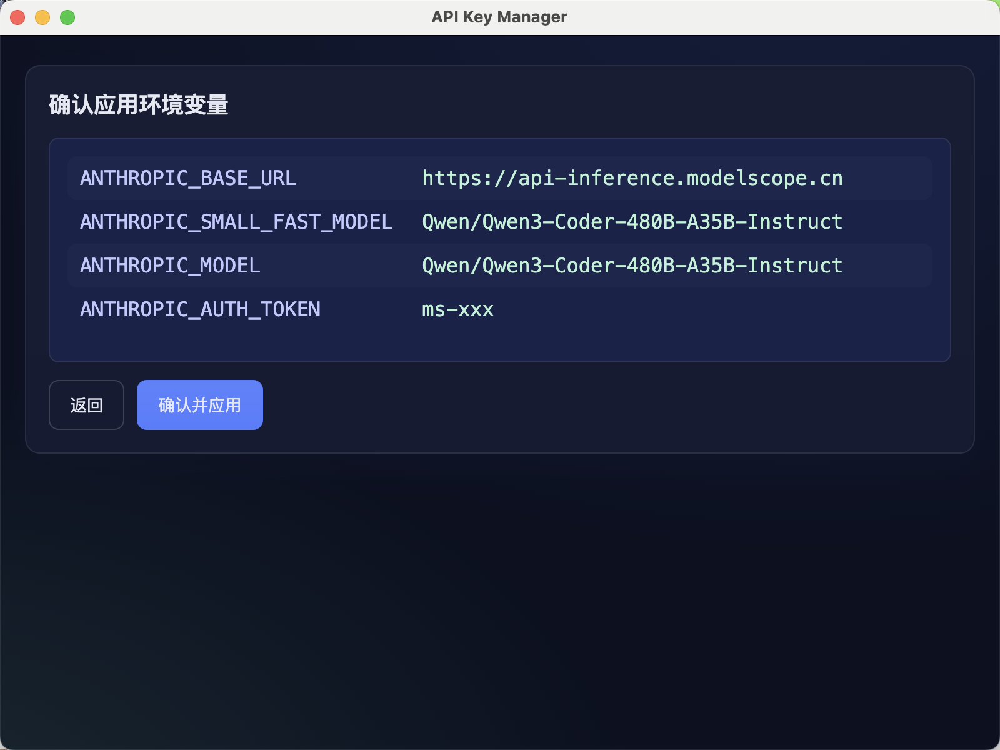

# API Key Manager

一个安全、易用的 API 密钥管理工具，帮助开发者轻松管理不同模型提供商的 API 密钥，并自动注入到环境变量中。

## 功能特点

- 🔐 安全存储 API 密钥在本地
- 🖥️ 简洁直观的用户界面
- 🔄 快速切换不同账号和环境配置
- 🛡️ 不会上传任何密钥到外部服务器
- 🚀 支持多种模型提供商和产品

## 安装

### 从源码构建

1. 克隆仓库：
   ```bash
   git clone https://github.com/daydaylubi/api-key-manager.git
   cd api-key-manager
   ```

2. 安装依赖：
   ```bash
   npm install
   ```

3. 构建应用：
   ```bash
   # 开发模式
   npm run dev
   
   # 构建生产版本
   npm run dist:mac
   ```

## 配置

1. 在 `~/.api-key-manager/` 目录下创建 `config.toml` 配置文件（可参考 `config-example.toml`）

2. 配置模型提供商、产品和账号信息，例如：
   ```toml
   [models.modelscope]
   name = "ModelScope"

   [models.modelscope.accounts.personal]
   name = "个人账号"
   token = "your-token-here"

   [models.modelscope.products.claude_code]
   name = "Claude Code"
   token_field = "ANTHROPIC_AUTH_TOKEN"
   
   [models.modelscope.products.claude_code.default_config]
   ANTHROPIC_BASE_URL = "https://api-inference.modelscope.cn"
   ANTHROPIC_MODEL = "Qwen/Qwen3-Coder-480B-A35B-Instruct"
   ```

## 使用指南

1. 启动应用后，选择模型提供商、产品和账号
2. 查看生成的环境变量预览
3. 点击"应用到环境"按钮将环境变量注入到当前 shell 会话






## 开发

```bash
# 安装依赖
npm install

# 启动开发服务器
npm run dev

# 构建生产版本
npm run build

# 构建并打包应用
npm run dist:mac
```

## 贡献

欢迎提交 Issue 和 Pull Request。对于重大更改，请先开启 issue 讨论您想要更改的内容。

## 许可证

[MIT](LICENSE)
